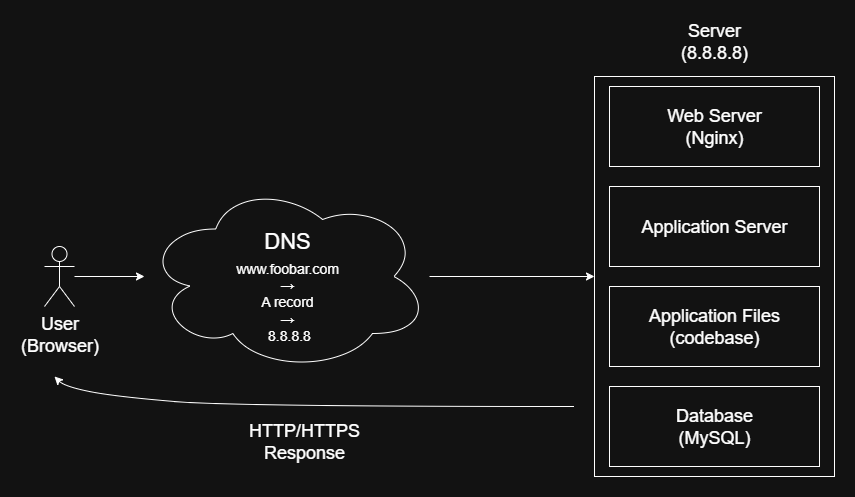

# 0. Simple web stack

## Infrastructure Overview
- Domain name: **foobar.com** with a `www` subdomain
- DNS record: **A record** mapping `www.foobar.com` → `8.8.8.8`
- One server (`8.8.8.8`) containing:
  - Web Server (**Nginx**)
  - Application Server
  - Application Files (Code base)
  - Database (**MySQL**)
- Communication: **HTTP/HTTPS** between the server and the user’s browser

---

## Key Explanations

### What is a server?
A server is a powerful computer that provides services or resources to other computers (clients).
Here, it hosts the website and responds to user requests.

### What is the role of the domain name?
The domain name is a human-readable address (e.g., `foobar.com`).
It allows users to access the website easily instead of using the raw IP address.

### What type of DNS record is `www` in `www.foobar.com`?
The `www` is a subdomain.
It uses an **A record** to map the domain name to the server’s IP address (`8.8.8.8`).

### What is the role of the web server?
The web server (Nginx) handles HTTP/HTTPS requests.
It serves static content or forwards requests to the application server.

### What is the role of the application server?
The application server runs the application code, processes the business logic,
and communicates with the database to generate dynamic content.

### What is the role of the database?
The database (MySQL) stores and retrieves data for the application,
such as users, posts, or transactions.

### What is the server using to communicate with the user’s computer?
The server communicates with the user’s browser using the **HTTP/HTTPS protocol** over the Internet.

---

## Issues with this Infrastructure

- **SPOF (Single Point of Failure):**
  If the only server goes down, the website is completely unavailable.

- **Downtime during maintenance:**
  Restarting the server or deploying new code causes service interruption.

- **Cannot scale with high traffic:**
  One server cannot handle too many users at once, leading to slowness or unavailability.
