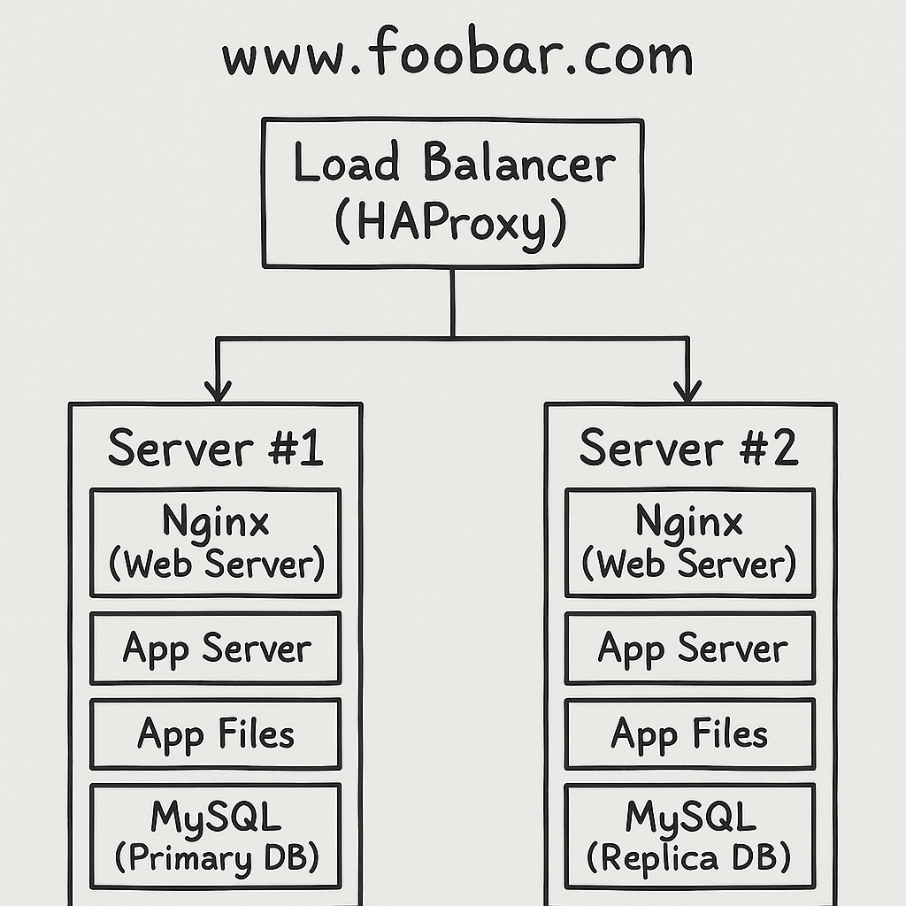

# 1. Distributed web infrastructure

## Infrastructure Overview

This infrastructure is composed of **three servers**:

-   **Server #1:** Nginx, App server, App files, MySQL Primary (Master)
-   **Server #2:** Nginx, App server, App files, MySQL Replica (Slave)
-   **Load Balancer:** HAProxy

------------------------------------------------------------------------

## Components Explanation

-   **HAProxy (Load Balancer):** Distributes traffic between the two
    servers so users don't always hit the same one.

-   **Nginx (Web Server):** Handles HTTP requests, serves static files,
    forwards dynamic requests to the application server.

-   **Application Server:** Runs the business logic of the website.

-   **Application Files:** The code base (PHP, Python, Node.js, etc.).

-   **MySQL Database:** Stores persistent data. One is Primary (write)
    and one is Replica (read).

------------------------------------------------------------------------

## Load Balancer Details

-   **Algorithm:** Round Robin (each request is sent to the next server
    in turn).
-   **Setup:** Active-Active (both servers are used simultaneously).

### Active-Active vs Active-Passive

-   **Active-Active:** Both servers handle requests at the same time.
-   **Active-Passive:** One server is active, the other only takes over
    if the first fails.

------------------------------------------------------------------------

## Database Primary-Replica Cluster

-   **Primary (Master):** Handles writes (INSERT, UPDATE, DELETE).
-   **Replica (Slave):** Receives replicated data and handles reads
    (SELECT).
-   **For the Application:** Writes always go to the Primary, reads can
    be distributed.

------------------------------------------------------------------------

## Issues with this Infrastructure

-   **Single Points of Failure (SPOF):**
    -   Load balancer (if it goes down, the entire site is unavailable).
    -   Servers contain everything (web + app + DB), no separation of
        concerns.
-   **Security Issues:**
    -   No firewall.
    -   No HTTPS (data is sent in clear text).
    -   Database exposed without protection.
-   **No Monitoring:**
    -   No way to detect overload, downtime, or attacks.

------------------------------------------------------------------------
