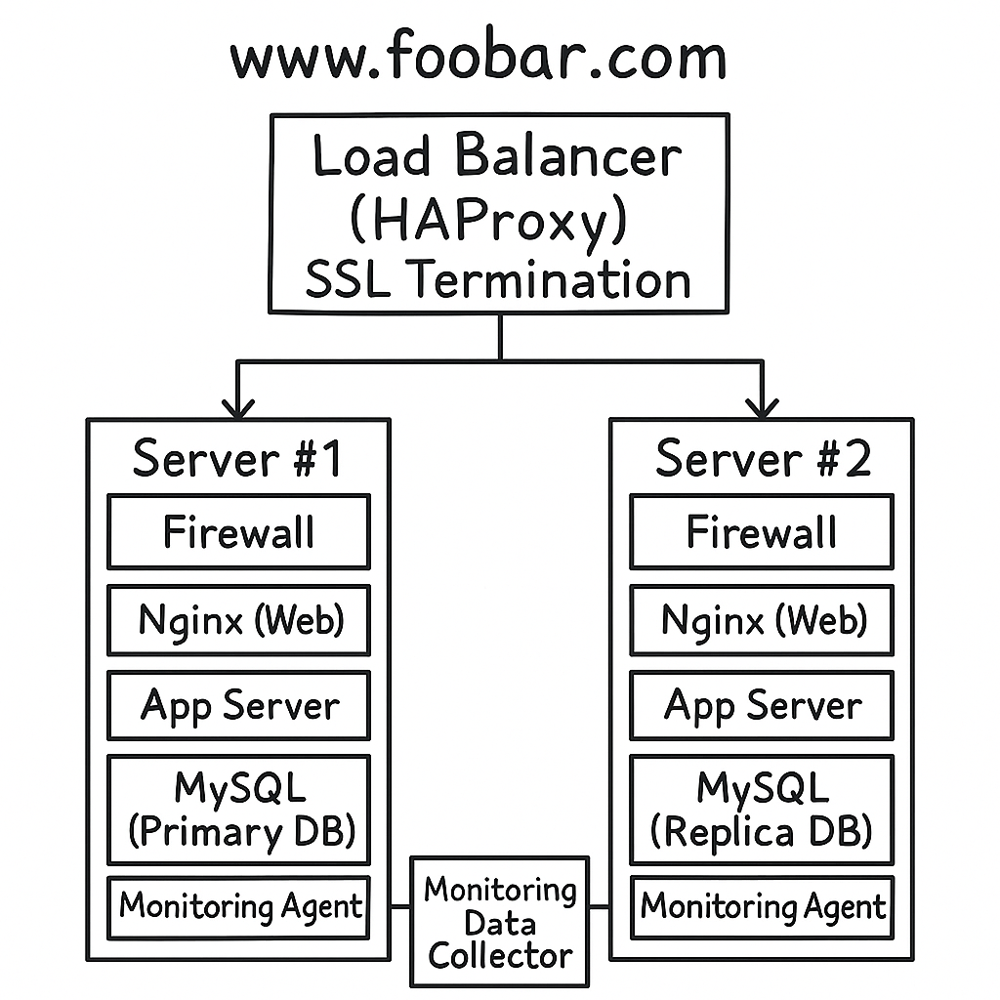

# Secured and Monitored Web Infrastructure - www.foobar.com

## Infrastructure Overview

This infrastructure is composed of **three servers** and includes
**security and monitoring**:

-   **Load Balancer (HAProxy):** SSL termination, distributes traffic to
    backend servers.
-   **Server #1:** Firewall, Nginx, App server, App files, MySQL
    Primary, Monitoring agent.
-   **Server #2:** Firewall, Nginx, App server, App files, MySQL
    Replica, Monitoring agent.
-   **Monitoring system:** Centralized data collector (e.g., Sumologic).

------------------------------------------------------------------------

## Components Explanation

-   **Firewalls (3):**\
    Each server, including the load balancer, is protected by a firewall
    to filter and block unauthorized traffic.

-   **SSL Certificate (HTTPS):**\
    Ensures encrypted traffic between users and the website, protecting
    against eavesdropping and tampering.

-   **Monitoring Clients (3):**\
    Agents running on each server collect logs and metrics (CPU, memory,
    QPS) and send them to a central monitoring service.

------------------------------------------------------------------------

## Security and Monitoring Details

-   **Firewalls:**\
    Control inbound and outbound network traffic, only allowing trusted
    connections.

-   **Why HTTPS:**\
    Encryption secures communication, provides confidentiality,
    integrity, and builds user trust.

-   **Monitoring purpose:**\
    Provides visibility into performance, availability, and security
    issues. Enables proactive alerts.

-   **How monitoring collects data:**\
    Agents run locally on servers, gather logs and metrics, and forward
    them to a centralized service (Sumologic, Prometheus, etc.).

-   **Monitoring QPS:**\
    Configure the agent to collect metrics from Nginx or HAProxy (e.g.,
    status module). Data is sent to dashboards and used to set alerts.

------------------------------------------------------------------------

## Issues with this Infrastructure

-   **SSL termination at the load balancer:**\
    Traffic between load balancer and backend servers is not encrypted,
    exposing data inside the private network.

-   **Only one MySQL server for writes:**\
    The Primary DB is a single point of failure. If it fails, no writes
    are possible.

-   **Servers with all components (DB, web, app):**\
    Causes resource contention, scaling issues, and complex maintenance,
    as each server duplicates unnecessary components.

------------------------------------------------------------------------
