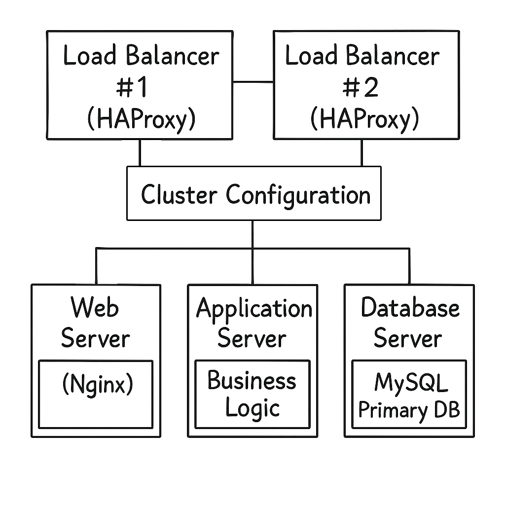

# Distributed Infrastructure with Component Separation - www.foobar.com

## Infrastructure Overview

This setup improves scalability and reliability by splitting components
into dedicated servers and introducing a **load-balancer cluster**:

-   **Load Balancer Cluster (2x HAProxy):** Two HAProxy servers
    configured as a cluster for redundancy and failover.
-   **Web Server:** Dedicated server running Nginx to handle HTTP/HTTPS
    requests and serve static files.
-   **Application Server:** Dedicated server running the business logic
    of the application.
-   **Database Server:** Dedicated MySQL server for persistent data
    storage.

------------------------------------------------------------------------

## Components Explanation

-   **Additional Load Balancer (HAProxy #2):**\
    Added to prevent a single point of failure. Both load balancers
    share the same configuration and work in cluster mode, ensuring
    continuous service availability.

-   **Dedicated Web Server:**\
    Isolates HTTP handling and static content from other components,
    enabling independent scaling of the web layer.

-   **Dedicated Application Server:**\
    Separates business logic execution from the web and database layers,
    allowing modular growth and performance optimization.

-   **Dedicated Database Server:**\
    Keeps persistent data on its own server, improving performance and
    simplifying database management independently from the application
    and web servers.

------------------------------------------------------------------------

✅ Summary:\
This infrastructure reduces contention by separating roles, improves
modularity, and increases availability with a load balancer cluster.
Each component (web, app, DB) can now be scaled and maintained
independently depending on system requirements.

------------------------------------------------------------------------
